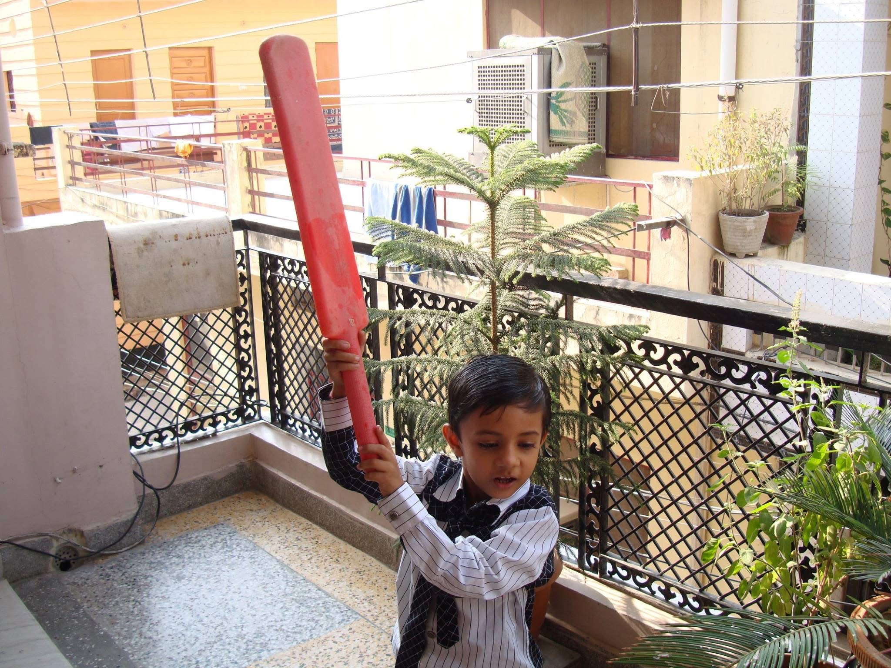
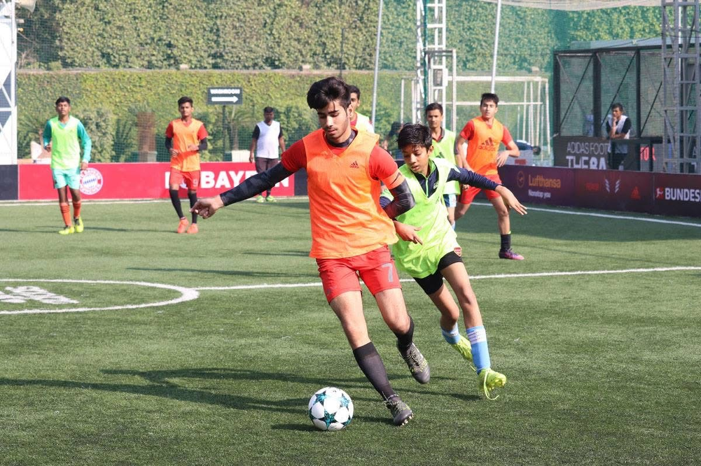
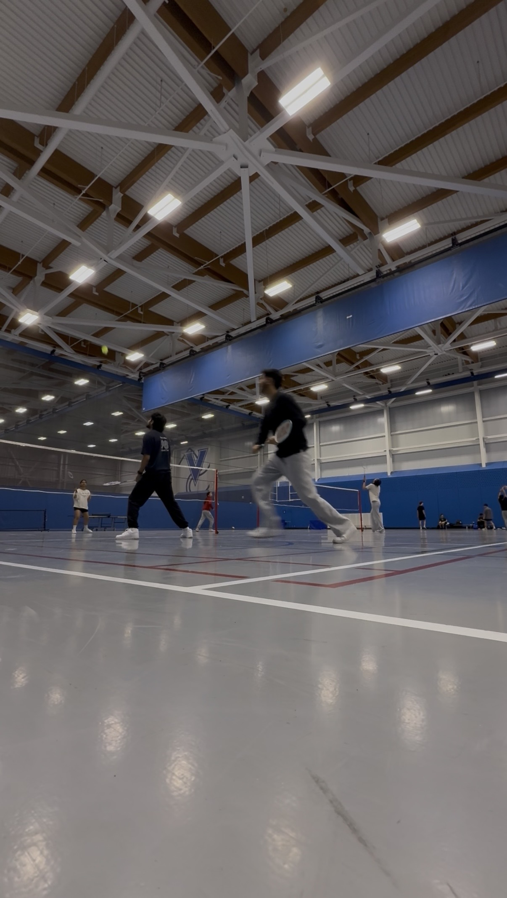

Ever since I was a kid, I loved playing sports. Be it football, cricket (I grew up in India), badminton or anything else that involved me moving around for a couple of hours with some friends.

Even today, as a 22 year old guy with a full time job, I wait for 8pm eagerly everyday to meet my friends and play!

While talking to a friend, I discussed how going to the gym was not as fun for me as it was to go out and play, he pointed out that it might be because I love socializing more than playing. Even though I did not agree, this was definitely some food for thought. Do I really like to meet people to socialize and sport is just a medium (or excuse) for it?

When I thought about it a little more, it seemed to be a real thing; I love to play sports and meet new people. Probably also a reason why I have enjoyed playing team sports predominantly because of the social factor that comes into play!

There have to be more people thinking about the same thing, wanting to play a sport of their choice and wanting to meet new people via it. There are two different problems around this as I see:

1) Helping people who want to play the same sport, around the same location, at the same time connect with each other
2) Helping people book facilities around them to play

Both of these issues stem from my own life, wanting to play sports but not having enough people or a place to play at. Moving towards an increasing health aware population in the world that is more disconnected in reality, this seems to be an obvious move!

There are markers for both the statements I made above:
1) **Increasing Health aware population**: Increase in the adoption of health trackers like whoop and now Google fitbit air
2) **Disconnected in reality population**: Increase in digital media consumption, increase in AI as a companion adoption

The possibilities with a platform like this are unlimited but helping people connect and be active in the process is something I want to solve for myself and the world.

Coming soon - MatchPlay!

<video autoplay loop muted playsinline width="100%" style="display:block; max-width:100%; height:auto;">
  <source src="/videos/cricket.mp4" type="video/mp4" />
  Your browser does not support the video tag.
</video>

...