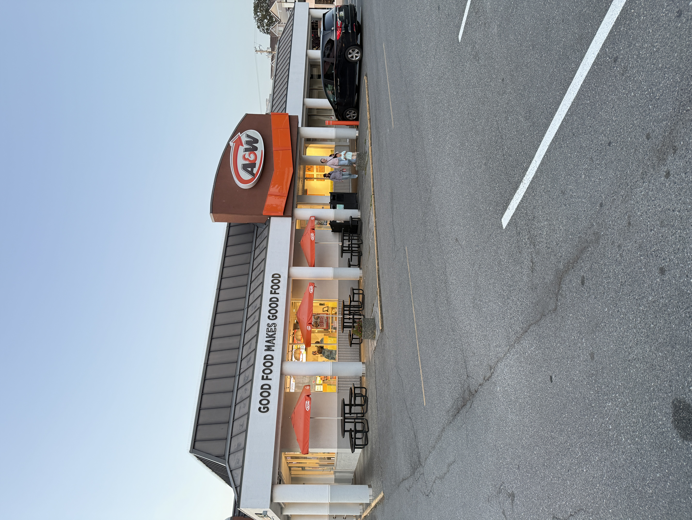
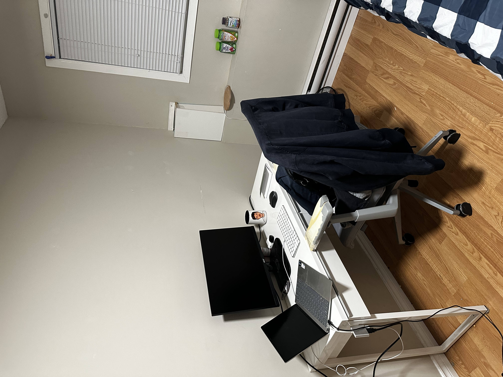
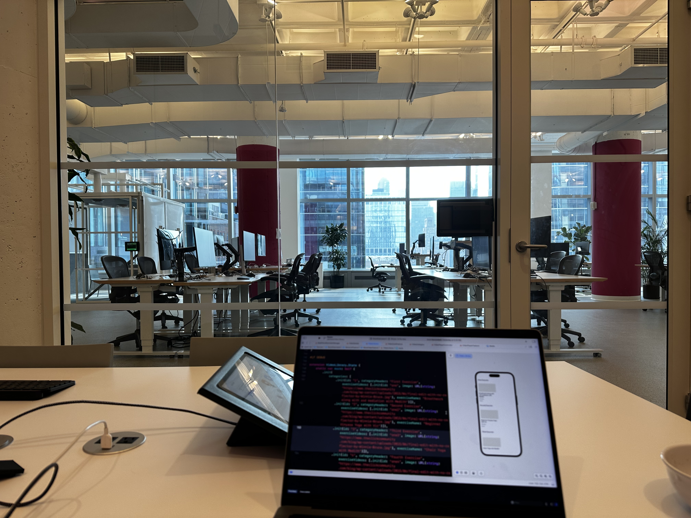
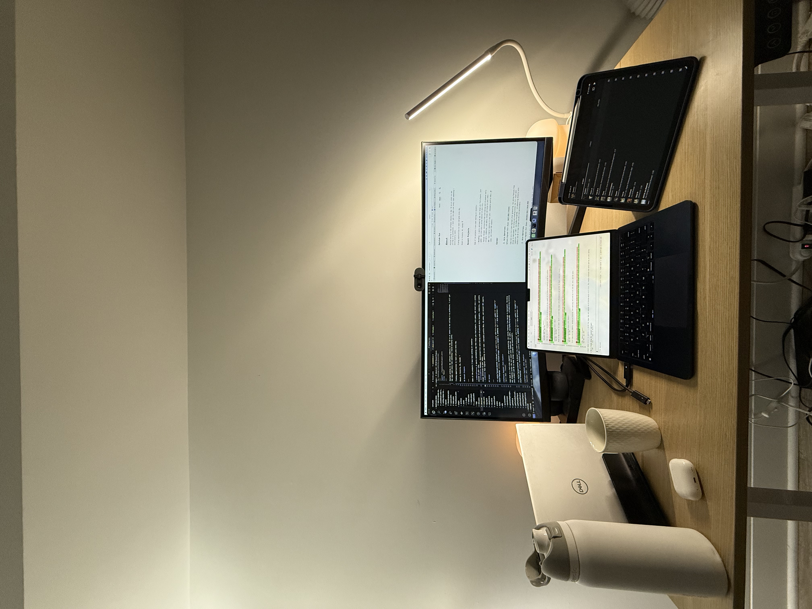
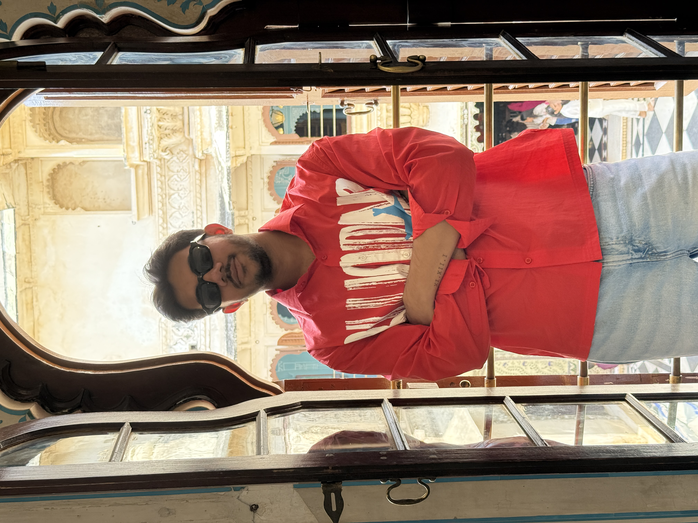
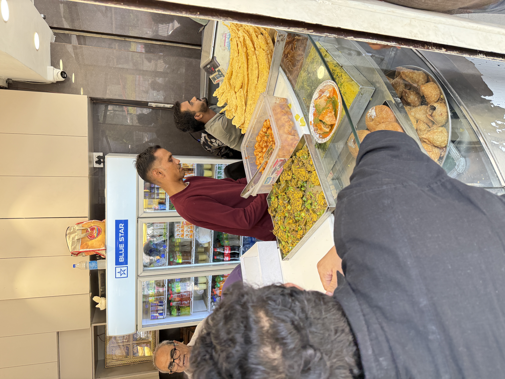
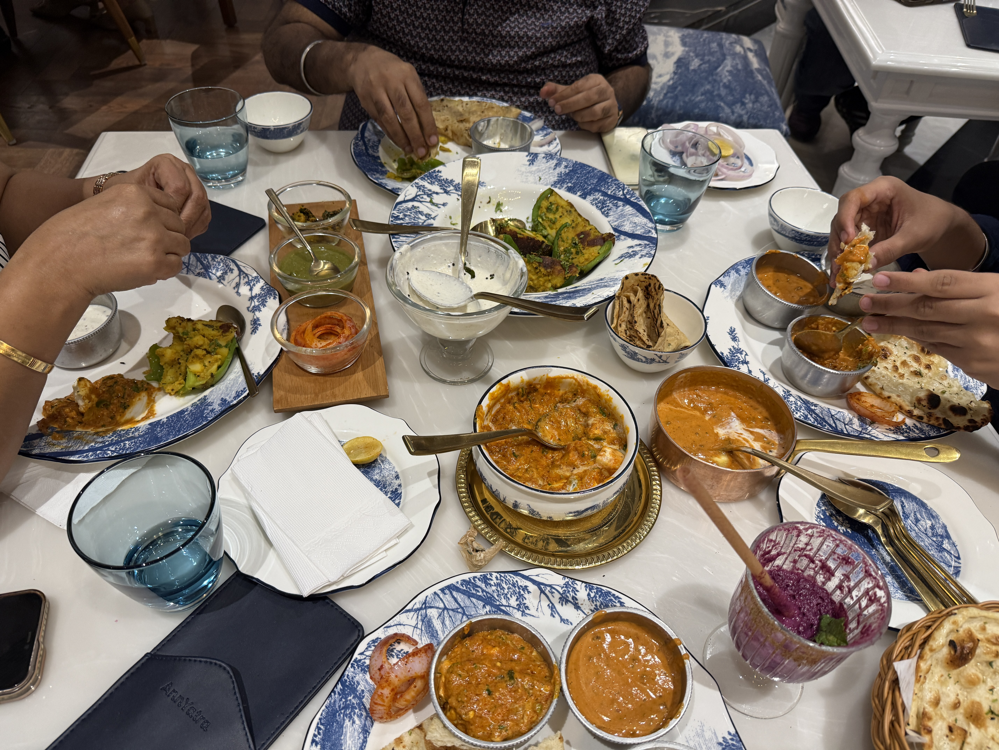

My first paycheck was CA$324 from my part time job as a cashier at A&W. I was probably getting paid around CA$16/hour and it was so exciting to make money for the first time. Overtime though, it was not as fun to go into work over the weekends or weekdays after classes because I was not dealing with new problems anymore, it was just the same set of tasks on repeat for 8 hours.

Cut to a couple of years later, I started working as a software developer. Tackling interesting, difficult and most importantly new problems every day. I was still working before and after classes but now, I was looking forward to it! Putting the same number of hours with the same course load but it stopped feeling like a job.

Cut to now, I have completed more than a year of full time work and for the first time I took a vacation using my PTO (Paid time off) i.e, Employers generally provide some specific number of days in a year where you don't have to come into / log onto work while still getting paid.

This was the first time in the last 5 years (since I started my undergrad in Fall '21) that I was getting paid while I was not working. As interesting as it might sound, I was not sure what to really do except go and meet my parents, so I came back to India for a month.

Not having to work on anything since I was done with school and was off from work was kind of weird, that is when I actually thought about MatchPlay and started posting short form content about it on Instagram. I feel at the core of it, I realized that not working on something regularly is very unsettling to me atleast for now. Not sure if that is caused by my own aspirations, my own expectations to achieve those aspirations or some childhood trauma linking "not doing something that is CONSIDERED productive regularly" with "wasting time". 

In any case, I think PTO was fun, got to see my family, eat tasty indian food, visit a couple of different places in India and also got a great idea that will consume my mindspace until it goes live!

...